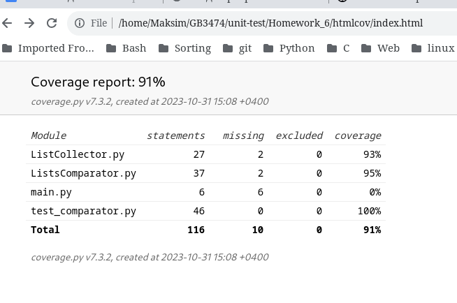
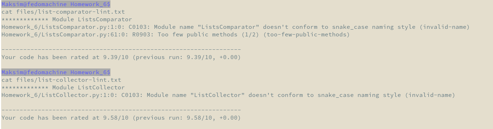

# GB3474. Homework 6. List Comparator

> Задание 1. Создайте программу на Python или Java, которая принимает два списка чисел и выполняет следующие действия:\
> a. Рассчитывает среднее значение каждого списка.\
> b. Сравнивает эти средние значения и выводит соответствующее сообщение:
> - Первый список имеет большее среднее значение, если среднее значение первого списка больше.
> - Второй список имеет большее среднее значение, если среднее значение второго списка больше.
> - Средние значения равны, если средние значения списков равны.
> 
> Важно:
> Приложение должно быть написано в соответствии с принципами объектно-ориентированного программирования.
> Используйте Pytest (для Python) или JUnit (для Java) для написания тестов, которые проверяют правильность работы программы. Тесты должны учитывать различные сценарии использования вашего приложения.
> Используйте pylint (для Python) или Checkstyle (для Java) для проверки качества кода.
> Сгенерируйте отчет о покрытии кода тестами. Ваша цель - достичь минимум 90% покрытия.

## Tests description

### Тесты на правильность расчетов среднего значения двух списков функцией 'compare_by_mean'

* test_integer_list\
  на списках с разными целочисленными значениями.
* test_float_list\
  на списках с разными вещественными числами.
* test_string_list\
  на списках с различными строками.
* test_empty_list\
  пустых списках.
* test_bool_list\
  списках с булевыми значениями.

### Тесты на исключения и экстренное завершение программы с кодом ошибки

* test_type_error\
  подача неверных аргументов функции compare_by_mean вызывает исключение.
* test_exit_one\
  при наличии элементов, не содержащих значений программа завершается с кодом 1.

### Тесты сборщика списков

* test_collector\
  тестирует сборщик на создание списков с правильным типом данных.
* test_parser\
  тестирует разбор строки на элементы.

## Test coverage

> main.py не содержит никакой логики, используется для запуска.

## Linter

